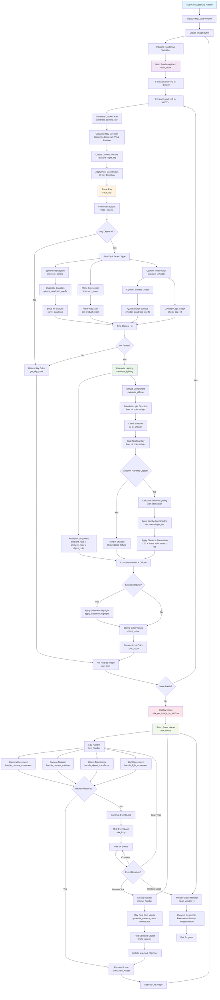

```mermaid
flowchart TD
    A[Scene Successfully Parsed] --> B[Initialize MLX and Window]

    B --> C[Create Image Buffer]
    C --> D[Initialize Rendering Variables]

    D --> E[Main Rendering Loop<br/>main_draw]

    E --> F[For each pixel y=0 to HEIGHT]
    F --> G[For each pixel x=0 to WIDTH]

    G --> H[Generate Camera Ray<br/>generate_camera_ray]

    H --> I[Calculate Ray Direction<br/>Based on Camera FOV & Position]
    I --> J[Create Camera Vectors<br/>Forward, Right, Up]
    J --> K[Apply Pixel Coordinates<br/>to Ray Direction]

    K --> L[Trace Ray<br/>trace_ray]

    L --> M[Find Intersections<br/>trace_objects]

    M --> N{Any Object Hit?}

    N -->|No| O[Return Sky Color<br/>get_sky_color]

    N -->|Yes| P[Test Each Object Type]

    P --> Q[Sphere Intersection<br/>intersect_sphere]
    P --> R[Plane Intersection<br/>intersect_plane]
    P --> S[Cylinder Intersection<br/>intersect_cylinder]

    Q --> T[Quadratic Equation<br/>sphere_quadratic_coeffs]
    T --> U[Solve for t values<br/>solve_quadratic]

    R --> V[Plane-Ray Math<br/>dot product check]

    S --> W[Cylinder Surface Check]
    S --> X[Cylinder Caps Check<br/>check_cap_hit]
    W --> Y[Quadratic for Surface<br/>cylinder_quadratic_coeffs]

    U --> Z[Find Closest Hit]
    V --> Z
    Y --> Z
    X --> Z

    Z --> AA{Hit Found?}

    AA -->|No| O
    AA -->|Yes| BB[Calculate Lighting<br/>calculate_lighting]

    BB --> CC[Ambient Component<br/>ambient_ratio x ambient_color x object_color]
    BB --> DD[Diffuse Component<br/>calculate_diffuse]

    DD --> EE[Calculate Light Direction<br/>from hit point to light]
    EE --> FF[Check Shadow<br/>is_in_shadow]

    FF --> GG[Cast Shadow Ray<br/>from hit point to light]
    GG --> HH{Shadow Ray Hits Object?}

    HH -->|Yes| II[Point in Shadow<br/>Return black diffuse]
    HH -->|No| JJ[Calculate Diffuse Lighting<br/>with attenuation]

    JJ --> KK[Apply Lambertian Shading<br/>dot normal light_dir]
    KK --> LL[Apply Distance Attenuation<br/>1 / 1 + linear x d + quad x d2]

    II --> MM[Combine Ambient + Diffuse]
    LL --> MM
    CC --> MM

    MM --> NN{Selected Object?}
    NN -->|Yes| OO[Apply Selection Highlight<br/>apply_selection_highlight]
    NN -->|No| PP[Clamp Color Values<br/>clamp_color]
    OO --> PP

    PP --> QQ[Convert to Int Color<br/>color_to_int]
    QQ --> RR[Put Pixel to Image<br/>put_pixel]

    RR --> SS{More Pixels?}
    SS -->|Yes| G
    SS -->|No| TT[Display Image<br/>mlx_put_image_to_window]

    TT --> UU[Setup Event Hooks<br/>mlx_hooks]

    UU --> VV[Key Handler<br/>key_handler]
    UU --> WW[Mouse Handler<br/>mouse_handler]
    UU --> XX[Window Close Handler<br/>close_window_x]

    VV --> YY[Camera Movement<br/>handle_camera_movement]
    VV --> ZZ[Camera Rotation<br/>handle_camera_rotation]
    VV --> AAA[Object Transforms<br/>handle_object_transforms]
    VV --> BBB[Light Movement<br/>handle_light_movement]

    YY --> CCC{Redraw Required?}
    ZZ --> CCC
    AAA --> CCC
    BBB --> CCC

    CCC -->|Yes| DDD[Redraw Scene<br/>draw_new_image]
    CCC -->|No| EEE[Continue Event Loop]

    DDD --> FFF[Destroy Old Image]
    FFF --> C

    WW --> GGG[Ray Cast from Mouse<br/>generate_camera_ray at mouse pos]
    GGG --> HHH[Find Selected Object<br/>trace_objects]
    HHH --> III[Update selected_obj index]
    III --> DDD

    EEE --> JJJ[MLX Event Loop<br/>mlx_loop]
    JJJ --> KKK[Wait for Events]
    KKK --> LLL{Event Received?}
    LLL -->|Key Press| VV
    LLL -->|Mouse Click| WW
    LLL -->|Window Close| XX
    LLL -->|Continue| KKK

    XX --> MMM[Cleanup Resources<br/>Free scene destroy image/window]
    MMM --> NNN[Exit Program]

    O --> RR

    classDef startStyle fill:#e1f5fe
    classDef mainLoop fill:#f3e5f5
    classDef rayTrace fill:#fff3e0
    classDef lighting fill:#e8f5e8
    classDef display fill:#fce4ec
    classDef events fill:#f1f8e9

    class A startStyle
    class E mainLoop
    class L rayTrace
    class BB lighting
    class TT display
    class UU events
```